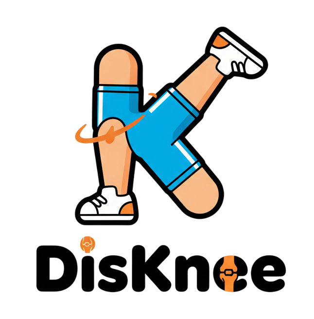

# 
DisKnee

  

**AI-powered knee rehabilitation that makes home recovery feel guided, measurable, and motivating.**

## Rehab, redesigned

DisKnee is a virtual physiotherapy experience built to support knee recovery beyond the clinic. It combines real-time motion tracking, guided exercise sessions, progress analytics, reflections, streaks, and telehealth-style touchpoints in one product designed to keep patients engaged from day one to full confidence.

Originally created for **Hack 2 Heal at UNSW**, DisKnee was selected as a **finalist project**, and the product still reflects that hackathon energy: ambitious, patient-centered, and built to turn rehab from a repetitive chore into a feedback-rich recovery journey.

## Why it stands out

|                                 |                                                                                               |
| ------------------------------- | --------------------------------------------------------------------------------------------- |
| **Real-time pose detection**    | Tracks movement during exercises and gives instant form-aware feedback.                       |
| **Adaptive recovery flow**      | Sessions, progress, and motivation systems keep patients consistent over time.                |
| **Built for actual users**      | Combines exercises, reports, reflections, appointments, and a rewards loop in one experience. |
| **Hackathon-to-product vision** | Designed not just as a prototype, but as a credible digital rehab platform.                   |

## Experience highlights

### Real-time recovery guidance

DisKnee uses computer vision to monitor knee rehabilitation exercises, helping users correct form, count reps, and stay aligned with their recovery plan from home.

### Motivation built into the product

Recovery is hard to sustain when progress feels invisible. DisKnee adds streaks, milestone tracking, reflections, leaderboards, and a points-based shop to make consistency feel rewarding.

### A fuller care journey

This is more than an exercise counter. The platform also includes appointment flows, reports, progress views, and patient-facing support surfaces that make the experience feel closer to a complete rehab companion.

## Product snapshot

- Guided rehabilitation exercises with video support
- Pose-aware exercise session tracking
- Reports and progress analytics
- Reflection logging and recovery journaling
- Streaks, points, rewards, and leaderboard mechanics
- Appointment and care-touchpoint flows
- Modern web app architecture with a separate pose backend

## Built with

- `Next.js 16`, `React 19`, `TypeScript`
- `Tailwind CSS 4`, `shadcn/ui`
- `Prisma` + `PostgreSQL`
- `Better Auth`
- Python-based pose detection backend

## For judges, recruiters, and collaborators

DisKnee is the kind of project that sits in a strong middle ground: technically ambitious enough to demonstrate real engineering depth, but product-focused enough to feel like something people could actually use. It brings together frontend craft, full-stack product thinking, data modeling, authentication, and motion-analysis workflows in a single cohesive experience.

## Documentation

The developer and technical documentation now lives in [`docs/README.md`](docs/README.md).

- Setup and local development: [`docs/DEVELOPER_GUIDE.md`](docs/DEVELOPER_GUIDE.md)
- Architecture notes: [`docs/ARCHITECTURE.md`](docs/ARCHITECTURE.md)
- Technical deep dive: [`docs/TECHNICAL_DEEP_DIVE.md`](docs/TECHNICAL_DEEP_DIVE.md)
- Database setup: [`docs/DB-SETUP.md`](docs/DB-SETUP.md)
- Local Supabase setup: [`docs/LOCAL-SUPABASE.md`](docs/LOCAL-SUPABASE.md)
