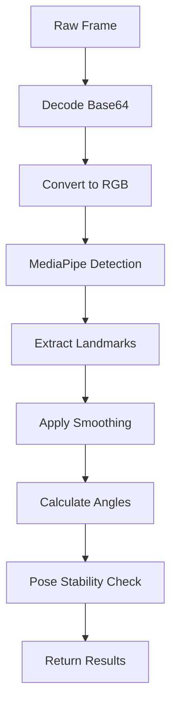
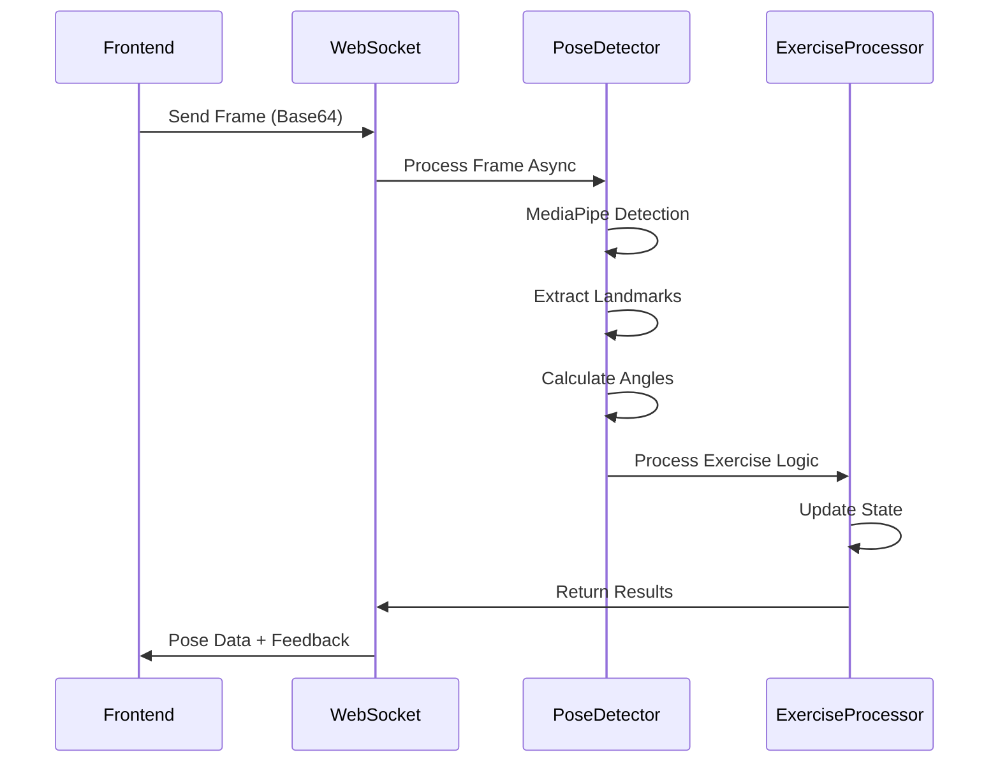

# DisKnee Application Architecture

## Overview

DisKnee is a comprehensive physiotherapy application that provides real-time pose detection and feedback for knee rehabilitation exercises. The application uses computer vision to track user movements and provide exercise guidance through a web-based interface.

## Table of Contents

1. [High-Level Architecture](#high-level-architecture)
2. [Frontend Architecture](#frontend-architecture)
3. [Backend Architecture](#backend-architecture)
4. [Pose Detection System](#pose-detection-system)
5. [Data Flow](#data-flow)
6. [Key Components](#key-components)
7. [Exercise Processing Logic](#exercise-processing-logic)
8. [Real-time Communication](#real-time-communication)
9. [Performance Optimizations](#performance-optimizations)
10. [Error Handling & Resilience](#error-handling--resilience)

---

## High-Level Architecture

```
┌─────────────────┐     WebSocket     ┌─────────────────┐
│   Frontend      │ ◄──────────────► │    Backend      │
│   (Next.js)     │                  │   (FastAPI)      │
│                 │                  │                 │
│ • Video Stream  │                  │ • Pose Detection│
│ • UI Components │                  │ • Exercise Logic│
│ • State Mgmt     │                  │ • WebSocket Mgr │
└─────────────────┘                  └─────────────────┘
         │                                   │
         │                                   │
    Camera Feed                        MediaPipe
         │                                   │
         ▼                                   ▼
   User's Body                         Pose Data
```

---

## Frontend Architecture

### Technology Stack

- **Framework**: Next.js 16 with App Router
- **Language**: TypeScript
- **Styling**: Tailwind CSS + Shadcn UI
- **State Management**: React hooks + Zustand
- **Real-time**: WebSocket client

### Key Components

#### VideoStream Component (`components/shared/video-stream.tsx`)

```typescript
interface VideoStreamProps {
  isVideoOn: boolean;
  isCallActive: boolean;
  exerciseId?: string;
  onPoseUpdate?: (data: PoseResult) => void;
  onCameraDistanceWarning?: (tooClose: boolean) => void;
  crownSettings?: CrownSettings;
  glassesSettings?: GlassesSettings;
}
```

**Responsibilities:**

- Captures video from user's camera
- Sends frames to backend via WebSocket
- Renders pose skeleton overlay
- Handles AR effects (crowns, glasses)
- Manages connection lifecycle

#### PoseSocketClient (`lib/pose-socket-client.ts`)

```typescript
class PoseSocketClient {
  private ws: WebSocket | null = null;
  private reconnectAttempts = 0;
  private maxReconnectAttempts = 5;
  private frameCount = 0;
}
```

**Features:**

- Automatic reconnection with exponential backoff (2s, 4s, 8s, 16s, 32s delays)
- Frame skipping for performance (sends every 2nd frame)
- JPEG compression for bandwidth optimization (70% quality)
- Connection state management

---

## Backend Architecture

### Technology Stack

- **Framework**: FastAPI
- **WebSocket**: Native FastAPI WebSocket support
- **Pose Detection**: MediaPipe (Google)
- **Image Processing**: OpenCV
- **Async Runtime**: Python asyncio
- **Logging**: Structlog

### API Endpoints

#### WebSocket Endpoint: `/ws/{exercise_id}`

```python
@app.websocket("/ws/{exercise_id}")
async def websocket_endpoint(websocket: WebSocket, exercise_id: str):
```

**Flow:**

1. Accept WebSocket connection
2. Initialize ExerciseProcessor for exercise type
3. Enter infinite loop to process messages
4. Handle different message types:
   - `frame`: Video frame for pose detection
   - `reset`: Reset exercise state

#### Health Check Endpoint: `/health/detailed`

```python
@app.get("/health/detailed")
async def health_check():
    return {
        "status": "healthy",
        "system": {
            "cpu_percent": psutil.cpu_percent(),
            "memory_percent": psutil.virtual_memory().percent,
            "active_connections": len(manager.active_connections),
        }
    }
```

---

## Pose Detection System

### PoseDetector Class (`backend/app/pose/detector.py`)

```python
class PoseDetector:
    def __init__(
        self,
        model_complexity: int = 0,  # 0: lite, 1: full, 2: heavy
        min_detection_confidence: float = 0.5,
        min_tracking_confidence: float = 0.5,
        enable_segmentation: bool = False,
        smooth_landmarks: bool = True,
        static_image_mode: bool = False,
        smoothing_factor: float = 0.7  # Exponential smoothing factor
    ):
```

**Key Features:**

1. **Multi-threaded Processing**: Uses ThreadPoolExecutor for non-blocking pose detection
2. **Temporal Smoothing**: Exponential smoothing of landmarks across frames
3. **Pose Stability Detection**: Calculates variance to determine if pose is stable
4. **Performance Optimization**: Frame skipping and configurable processing intervals

### Pose Detection Pipeline



#### Landmark Mapping

```python
LANDMARKS = {
    "RIGHT_HIP": 24,
    "RIGHT_KNEE": 26,
    "RIGHT_ANKLE": 28,
    "RIGHT_TOE": 32,
    "LEFT_HIP": 23,
    "LEFT_KNEE": 25,
    "LEFT_ANKLE": 27,
    "LEFT_TOE": 31,
    "RIGHT_SHOULDER": 12,
    "LEFT_SHOULDER": 11
}
```

#### Visibility Thresholds

```python
# Standard visibility: 0.3 (30% confidence)
# Low visibility (unstable pose): 0.1 (10% confidence)
# Average visibility check: 0.2 (20% across key landmarks)
```

#### Camera Distance Detection

```typescript
// If body occupies more than 80% of frame height, person is too close
const tooClose = bodyHeight > frameHeight * 0.8;
```

#### Angle Calculation Formula

```python
def calculate_angle(self, a: Tuple[float, float],
                    b: Tuple[float, float],
                    c: Tuple[float, float]) -> float:
    # Calculate angle at point b given three points a-b-c
    ba = a - b
    bc = c - b
    cosine_angle = np.dot(ba, bc) / (np.linalg.norm(ba) * np.linalg.norm(bc))
    angle = np.degrees(np.arccos(np.clip(cosine_angle, -1.0, 1.0)))
    return angle
```

---

## Data Flow

### Frame Processing Flow



### Data Structures

#### PoseResult Interface

```typescript
interface PoseResult {
  pose_detected: boolean;
  landmarks?: Landmark[];
  fps?: number;
  exercise_state: {
    reps: number;
    timer_started: boolean;
    ready_for_next: boolean;
    current_angle: number | null;
    hold_time: number;
    exercise_active: boolean;
  };
  exercise_id: string;
  feedback: string;
  angles: Record<string, number>;
  rep_completed: boolean;
  avg_visibility?: number;
  pose_stable?: boolean;
}
```

---

## Key Components

### ExerciseProcessor Class (`backend/app/pose/exercises.py`)

```python
class ExerciseProcessor:
    def __init__(self, exercise_id: str):
        self.exercise_id = exercise_id
        self.detector = PoseDetector()
        self.state = self._create_exercise_state(exercise_id)
        self.exercise_params = self._get_exercise_params(exercise_id)
```

**Responsibilities:**

1. **Frame Rate Control**: Processes frames at controlled intervals (min 50ms between frames)
2. **Exercise State Management**: Tracks reps, hold time, angles
3. **Exercise-Specific Logic**: Different logic for each exercise type
4. **Angle Smoothing**: Applies moving average or exponential smoothing

### ExerciseState Class

```python
class ExerciseState:
    def __init__(self):
        self.reps = 0
        self.timer_started = False
        self.start_time = None
        self.ready_for_next = True
        self.current_angle = 0.0  # Never null, always numeric
        self.hold_time = 0
        self.last_rep_time = 0
        self.exercise_active = False
        self.last_valid_angle = 0.0
        self.smoothed_angle = None
        self.angle_history = []  # For moving average
        self.max_history = 3  # Keep last 3 angles for smoothing
```

### ConnectionManager Class (`backend/app/models/session.py`)

```python
class ConnectionManager:
    def __init__(self):
        self.active_connections: Dict[str, Dict[str, WebSocket]] = {}
        self.client_metadata: Dict[str, Dict[str, any]] = {}
```

**Features:**

- Manages multiple concurrent WebSocket connections
- Groups connections by exercise type
- Handles graceful disconnections
- Tracks client metadata

---

## Exercise Processing Logic

### Supported Exercises

#### 1. Simple Squat

```python
"simple-squat": {
    "name": "Simple Squat",
    "hold_time_required": 0.0,  # No hold required
    "hip_depth_threshold": 120,    # Hip angle for squat depth
    "hip_reset_threshold": 160,     # Hip angle when standing
    "target_reps": 10
}
```

**Logic:**

- Detect when hip angle < 120° (squat position)
- Mark as in-squat state
- Detect when hip angle > 160° after squat (standing up)
- Increment rep counter

#### 2. Knee Extension

```python
"knee-extension": {
    "name": "Knee Extension",
    "hold_time_required": 2.0,
    "knee_extend_threshold": 160,  # Nearly straight
    "knee_reset_threshold": 100,   # Bent position
    "target_reps": 5
}
```

**Logic:**

- Hold knee extension > 160° for 2 seconds
- Count rep when hold time achieved
- Reset when knee angle < 100°

#### 3. Calf Raises

```python
"calf-raises": {
    "name": "Calf Raise",
    "hold_time_required": 3.0,
    "ankle_hold_threshold": 135,
    "ankle_reset_threshold": 120,
    "target_reps": 5
}
```

### Frame Processing Algorithm

```python
async def process_frame(self, frame_bytes: bytes, timestamp: float):
    # 1. Frame skipping for performance (min_process_interval = 50ms)
    if timestamp - self.last_processed_time < self.min_process_interval:
        return skipped_response()

    # 2. Process only every Nth frame (process_every_n_frames = 1)
    if self.frame_count % self.process_every_n_frames != 0:
        return skipped_response()

    # 3. Get pose detection
    pose_result = await self.detector.process_frame_async(frame_bytes, timestamp)

    # 4. Check visibility (avg_visibility_threshold = 0.2)
    avg_visibility = calculate_visibility(pose_result)
    if avg_visibility < 0.2:
        return low_visibility_response()

    # 5. Process exercise-specific logic
    result = process_exercise_logic(pose_result)

    # 6. Return results
    return result
```

---

## Real-time Communication

### WebSocket Message Types

#### Client → Server Messages

1. **Frame Message**

```json
{
  "type": "frame",
  "data": "base64-encoded-image",
  "timestamp": 1234567890
}
```

2. **Reset Message**

```json
{
  "type": "reset",
  "timestamp": 1234567890
}
```

#### Server → Client Messages

1. **Pose Result**

```json
{
  "type": "pose_result",
  "data": {
    "pose_detected": true,
    "landmarks": [...],
    "exercise_state": {...},
    "feedback": "Good! Now stand up",
    "angles": {"hip": 145.5},
    "rep_completed": false
  },
  "timestamp": 1234567890
}
```

2. **State Reset Confirmation**

```json
{
  "type": "state_reset",
  "timestamp": 1234567890
}
```

3. **Error Message**

```json
{
  "type": "error",
  "message": "Processing error",
  "timestamp": 1234567890
}
```

### Connection Management

```python
# Connection establishment
async def connect(websocket: WebSocket, exercise_id: str):
    await websocket.accept()
    client_id = generate_unique_id()
    store_connection(exercise_id, client_id, websocket)
    return client_id

# Graceful disconnection
async def disconnect(websocket: WebSocket, exercise_id: str):
    remove_connection(websocket)
    cleanup_processor(exercise_id)
```

---

## Performance Optimizations

### 1. Frame Skipping

- Send every 2nd frame by default (15 fps instead of 30)
- Configurable via `frameSkip` parameter (default: 2)
- Reduces bandwidth and CPU usage

### 2. Processing Intervals

- Minimum 50ms between frame processing (`min_process_interval`)
- Prevents overwhelming the backend
- Maintains responsive UI

### 3. Multi-threading

```python
with ThreadPoolExecutor(max_workers=2) as executor:
    loop = asyncio.get_event_loop()
    result = await loop.run_in_executor(
        executor,
        self.detector.process_frame,
        frame
    )
```

### 4. Pose Stability Detection

```python
def is_pose_stable(landmarks_history):
    # Calculate variance of landmark positions
    variance = calculate_variance(landmarks_history)
    return variance < stability_threshold  # Default: 0.1
```

### 5. Memory Management

- Limit landmark history to last 3 frames (`max_history = 3`)
- Clean up processors on disconnection
- Efficient array operations with NumPy

---

## Error Handling & Resilience

### 1. WebSocket Connection Errors

```python
async def safe_send_websocket(websocket: WebSocket, message: dict) -> bool:
    try:
        if websocket.application_state == "disconnected":
            return False
        await websocket.send_text(json.dumps(message))
        return True
    except Exception as e:
        logger.warning(f"Failed to send WebSocket message: {e}")
        return False
```

### 2. Pose Detection Failures

- Fallback to last known good angle
- Continue processing even with partial visibility
- Graceful degradation when landmarks aren't visible

### 3. Exercise State Consistency

- Initialize angles with 0.0 instead of null
- Never set angle to None during execution
- Always include angle values in responses

### 4. Client Reconnection

```typescript
// Automatic reconnection with exponential backoff
private reconnectDelay = 2000;  // Start with 2s delay
private maxReconnectAttempts = 5;

async reconnect() {
    if (this.reconnectAttempts < this.maxReconnectAttempts) {
        setTimeout(() => {
            this.reconnectAttempts++;
            this.connect();
        }, this.reconnectDelay * Math.pow(2, this.reconnectAttempts));
        // Delays: 2s, 4s, 8s, 16s, 32s
    }
}
```

---

## Security Considerations

1. **Input Validation**: All incoming messages validated for structure and type
2. **Resource Limits**: Frame rate limits prevent DoS attacks
3. **Connection Management**: Automatic cleanup of stale connections
4. **Data Privacy**: No video data stored permanently
5. **Error Information**: Sensitive details not exposed in error messages

---

## Monitoring & Logging

### Structured Logging

```python
logger.info(
    "Frame processed",
    exercise_id=exercise_id,
    fps=result.get("fps"),
    pose_detected=result.get("pose_detected"),
    processing_time=processing_time
)
```

### Health Metrics

- Active connections per exercise
- CPU and memory usage
- Frame processing rate
- Error rates

---

## Future Enhancements

1. **Machine Learning Integration**
   - Personalized exercise form analysis
   - Adaptive difficulty based on performance
   - Predictive analytics for recovery progress

2. **Advanced Pose Detection**
   - 3D pose estimation
   - Multiple person support
   - Fine-grained movement analysis

3. **Real-time Biometrics**
   - Heart rate monitoring
   - Fatigue detection
   - Muscle engagement analysis

4. **Expanded Exercise Library**
   - More exercise types
   - Custom exercise creation
   - Progression planning

---

## Conclusion

The DisKnee architecture demonstrates a sophisticated real-time computer vision application built with modern web technologies. The separation of concerns between frontend and backend, combined with efficient WebSocket communication and optimized pose detection, creates a responsive and scalable platform for physiotherapy exercises.

The key design principles that ensure reliability and performance:

1. **Asynchronous processing** prevents blocking
2. **Frame rate control** manages resources efficiently
3. **Graceful error handling** ensures resilience
4. **State consistency** prevents UI glitches
5. **Modular design** enables easy maintenance and extension
