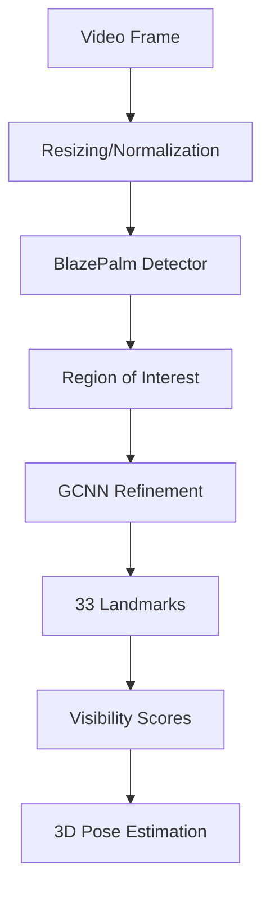

# Technical Deep Dive: Temporal Smoothing & MediaPipe Pose Detection

## Table of Contents

1. [Temporal Smoothing Explained](#temporal-smoothing-explained)
2. [Video FPS Analysis](#video-fps-analysis)
3. [MediaPipe Architecture](#mediapipe-architecture)
4. [Complete Data Flow](#complete-data-flow)
5. [Mathematical Foundations](#mathematical-foundations)
6. [Performance Optimizations](#performance-optimizations)
7. [Debugging and Monitoring](#debugging-and-monitoring)

---

## Temporal Smoothing Explained

### What is Temporal Smoothing?

Temporal smoothing is a technique used to reduce jitter and noise in time-series data by averaging values across multiple frames. In pose detection, this smooths out small fluctuations in landmark positions caused by:

- Camera noise
- Minor body movements
- Detection algorithm variations
- Compression artifacts

### Exponential Moving Average (EMA)

The DisKnee application uses exponential moving average (EMA) for smoothing:

```python
def _smooth_landmarks(self, landmarks: List[Dict]) -> List[Dict]:
    # Apply exponential smoothing with smoothing_factor = 0.7
    alpha = 1.0 - self.smoothing_factor  # alpha = 0.3

    smoothed_landmark = {
        "x": alpha * current_x + (1 - alpha) * previous_x,
        "y": alpha * current_y + (1 - alpha) * previous_y,
        "z": alpha * current_z + (1 - alpha) * previous_z
    }
```

### How EMA Works

The formula for exponential moving average is:

```
Smoothed[t] = α × Current[t] + (1 - α) × Smoothed[t-1]
```

Where:

- `α` (alpha) = smoothing factor (0.3 in DisKnee)
- Higher α = more responsive (less smoothing)
- Lower α = smoother but more laggy

### Example Calculation

Let's trace a single landmark's x-coordinate over 3 frames:

```python
smoothing_factor = 0.7
alpha = 1.0 - 0.7 = 0.3

# Frame 1: First frame (no history)
current_x = 0.5
smoothed_x = 0.5  # Use as-is

# Frame 2: Second frame
current_x = 0.52
smoothed_x = 0.3 × 0.52 + 0.7 × 0.5
smoothed_x = 0.156 + 0.35 = 0.506

# Frame 3: Third frame
current_x = 0.48
smoothed_x = 0.3 × 0.48 + 0.7 × 0.506
smoothed_x = 0.144 + 0.354 = 0.498
```

### Why Not Smooth Visibility?

```python
"visibility": landmark["visibility"]  # Don't smooth visibility
```

Visibility is not smoothed because:

1. It's a confidence metric, not a position
2. Rapid visibility changes indicate actual detection issues
3. We need accurate visibility to filter out poor detections

### Pose Stability Detection

```python
def _is_pose_stable(self, landmarks: List[Dict], threshold: float = 0.1) -> bool:
    # Calculate average movement from previous frame
    total_movement = 0
    count = 0

    for landmark in landmarks:
        prev = self.previous_landmarks[i]
        movement = abs(landmark["x"] - prev["x"]) + abs(landmark["y"] - prev["y"])
        total_movement += movement
        count += 1

    avg_movement = total_movement / count
    return avg_movement < threshold  # threshold = 0.1
```

---

## Video FPS Analysis

### Capture FPS (Frontend)

The frontend captures video using `requestAnimationFrame()`:

```typescript
// VideoStream component
animationRef.current = requestAnimationFrame(drawFrame);
```

- **Browser**: 60 FPS (typical for most displays)
- **Actual capture**: 60 FPS
- **Display rate**: 60 FPS (real-time rendering)

### Frame Skipping Strategy

```typescript
// PoseSocketClient
const frameSkip = this.options.frameSkip || 2; // Default: 2
if (this.frameCount % frameSkip !== 0) {
  return; // Skip this frame
}
```

- **Capture**: 60 FPS
- **Sent to backend**: 30 FPS (every 2nd frame)
- **Reasoning**: Reduces bandwidth and CPU load

### Backend Processing Rate

```python
# ExerciseProcessor
min_process_interval = 0.05  # 50ms = 20 FPS

if timestamp - self.last_processed_time < self.min_process_interval:
    return {"skipped": True}
```

- **Receives**: 30 FPS
- **Actually processes**: ~20 FPS (50ms intervals)
- **Final output to UI**: ~20 FPS

### FPS Calculation

```python
def _update_fps(self, timestamp: float):
    """Calculate actual processing FPS"""
    self.fps_counter += 1

    if timestamp - self.fps_start_time >= 1.0:
        self.current_fps = self.fps_counter / (timestamp - self.fps_start_time)
        # Example: 20 frames / 1 second = 20 FPS
```

### Performance Impact

| Stage               | FPS | Bandwidth | CPU Usage |
| ------------------- | --- | --------- | --------- |
| Camera Capture      | 60  | -         | Low       |
| Frame Compression   | 30  | ~3 MB/s   | Medium    |
| WebSocket Transfer  | 30  | ~3 MB/s   | Low       |
| Backend Processing  | 20  | -         | High      |
| MediaPipe Detection | 20  | -         | Very High |

---

## MediaPipe Architecture

### Overview

MediaPipe is Google's cross-platform, customizable ML solutions framework for live and streaming media. For pose detection, it uses:

- **BlazePalm**: Fast detector for initial pose estimation
- **GCNN**: Graph Convolutional Neural Network for refinement
- **Lightning Models**: Optimized for real-time performance

### Pose Landmarks

MediaPipe detects **33 landmarks** per person:

```python
LANDMARKS = {
    # Face (0-10)
    "NOSE": 0, "LEFT_EYE_INNER": 1, "LEFT_EYE": 2, "LEFT_EYE_OUTER": 3,
    "RIGHT_EYE_INNER": 4, "RIGHT_EYE": 5, "RIGHT_EYE_OUTER": 6,
    "LEFT_EAR": 7, "RIGHT_EAR": 8, "MOUTH_LEFT": 9, "MOUTH_RIGHT": 10,

    # Upper Body (11-22)
    "LEFT_SHOULDER": 11, "RIGHT_SHOULDER": 12, "LEFT_ELBOW": 13, "RIGHT_ELBOW": 14,
    "LEFT_WRIST": 15, "RIGHT_WRIST": 16, "LEFT_PINKY": 17, "RIGHT_PINKY": 18,
    "LEFT_INDEX": 19, "RIGHT_INDEX": 20, "LEFT_THUMB": 21, "RIGHT_THUMB": 22,

    # Lower Body (23-32)
    "LEFT_HIP": 23, "RIGHT_HIP": 24, "LEFT_KNEE": 25, "RIGHT_KNEE": 26,
    "LEFT_ANKLE": 27, "RIGHT_ANKLE": 28, "LEFT_HEEL": 29, "RIGHT_HEEL": 30,
    "LEFT_FOOT_INDEX": 31, "RIGHT_FOOT_INDEX": 32
}
```

### Detection Pipeline



### Model Configuration

```python
self.pose = mp.solutions.pose.Pose(
    model_complexity=0,  # 0: Lite (fastest)
    min_detection_confidence=0.5,  # 50% confidence to detect pose
    min_tracking_confidence=0.5,   # 50% confidence to track
    smooth_landmarks=True,       # Built-in smoothing
    enable_segmentation=False      # No segmentation mask (faster)
)
```

### Model Complexity Trade-offs

| Complexity | Speed   | Accuracy | Use Case               |
| ---------- | ------- | -------- | ---------------------- |
| 0 (Lite)   | Fastest | Good     | Real-time applications |
| 1 (Full)   | Medium  | Better   | Balanced performance   |
| 2 (Heavy)  | Slowest | Best     | Offline processing     |

### Confidence Scores

Each landmark has a visibility score (0-1):

```python
landmark_data = {
    "x": float(landmark.x),  # Normalized 0-1
    "y": float(landmark.y),  # Normalized 0-1
    "z": float(landmark.z),  # Relative depth
    "visibility": float(landmark.visibility)  # 0-1 confidence
}
```

- **0.7-1.0**: Highly visible, reliable
- **0.5-0.7**: Partially visible, use with caution
- **< 0.5**: Poor visibility, may be inaccurate
- **0**: Not detected

---

## Complete Data Flow

### Frontend Processing

```typescript
// 1. Capture frame at 60 FPS
function drawFrame() {
  // 2. Draw skeleton overlay
  if (lastLandmarks.current) {
    drawSkeleton(ctx, lastLandmarks.current, flipped);
  }

  // 3. Check camera distance
  const tooClose = bodyHeight > frameHeight * 0.8;

  // 4. Send frame (every 2nd frame)
  if (poseClientRef.current && frameCount % 2 === 0) {
    poseClientRef.current.sendFrame(video);
  }

  requestAnimationFrame(drawFrame);
}
```

### Frame Preparation

```typescript
// Resize and compress for efficiency
const targetWidth = 640; // Downscale from typical 1920x1080
const targetHeight = 480; // 16:9 aspect ratio

canvas.width = targetWidth;
canvas.height = targetHeight;

// Mirror the image for natural interaction
ctx.scale(-1, 1);
ctx.drawImage(videoElement, -targetWidth, 0, targetWidth, targetHeight);

// Compress to JPEG (70% quality)
const imageData = canvas.toDataURL("image/jpeg", 0.7);
const base64Data = imageData.split(",")[1];
```

### WebSocket Transmission

```json
{
  "type": "frame",
  "data": "base64-encoded-jpeg-image",
  "timestamp": 16991234567890
}
```

### Backend Processing

```python
async def process_frame_async(self, frame_bytes: bytes, timestamp: float):
    # 1. Run in thread pool (non-blocking)
    loop = asyncio.get_event_loop()
    result = await loop.run_in_executor(
        self.executor,
        self._process_frame_sync,
        frame_bytes,
        timestamp
    )
    return result

def _process_frame_sync(self, frame_bytes: bytes, timestamp: float):
    # 2. Decode image
    nparr = np.frombuffer(frame_bytes, np.uint8)
    frame = cv2.imdecode(nparr, cv2.IMREAD_COLOR)

    # 3. Convert BGR to RGB
    rgb_frame = cv2.cvtColor(frame, cv2.COLOR_BGR2RGB)

    # 4. MediaPipe detection
    results = self.pose.process(rgb_frame)

    # 5. Extract landmarks
    landmarks = []
    for idx, landmark in enumerate(results.pose_landmarks.landmark):
        landmark_data = {
            "x": float(landmark.x),      # Normalized coordinates
            "y": float(landmark.y),      # 0.0 to 1.0
            "z": float(landmark.z),      # Relative depth
            "visibility": float(landmark.visibility)
        }
        landmarks.append(landmark_data)
```

### Pose Stability Check

```python
# Check if movement is too fast
if not self.detector._is_pose_stable(landmarks):
    return {
        "pose_detected": True,
        "pose_stable": False,
        "landmarks": smoothed_landmarks,
        "feedback": "Hold still for better tracking"
    }
```

### Angle Calculation

```python
def calculate_angle(self, a: Tuple[float, float],
                    b: Tuple[float, float],
                    c: Tuple[float, float]) -> float:
    """
    Calculate angle at point b given three points a-b-c
    """
    # Convert to numpy arrays
    a = np.array(a)
    b = np.array(b)
    c = np.array(c)

    # Calculate vectors
    ba = a - b  # Vector from b to a
    bc = c - b  # Vector from b to c

    # Calculate angle using dot product
    cosine_angle = np.dot(ba, bc) / (
        np.linalg.norm(ba) * np.linalg.norm(bc) + 1e-6
    )

    # Clamp to avoid numerical errors
    cosine_angle = np.clip(cosine_angle, -1.0, 1.0)

    # Convert to degrees
    angle = np.degrees(np.arccos(cosine_angle))
    return angle
```

### Example: Hip Angle for Squat

For a squat, we calculate the hip angle:

- Point A: Shoulder (landmark 12 or 11)
- Point B: Hip (landmark 24 or 23)
- Point C: Knee (landmark 26 or 25)

```
       Shoulder (A)
          *
          |\
          | \
          |  \
          |   \  θ
          |    \
        Hip (B)----Knee (C)
```

When standing straight: θ ≈ 170°
When in squat: θ ≈ 90°

---

## Mathematical Foundations

### Vector Mathematics for Angle Calculation

The angle between three points uses the dot product formula:

```
cos(θ) = (ba · bc) / (|ba| × |bc|)
```

Where:

- `ba = a - b` (vector from hip to shoulder)
- `bc = c - b` (vector from hip to knee)
- `|ba|` = magnitude of vector ba
- `|bc|` = magnitude of vector bc

### Exponential Smoothing Mathematics

The smoothing process forms a first-order IIR (Infinite Impulse Response) filter:

```
y[n] = αx[n] + (1-α)y[n-1]
```

Where:

- `y[n]` = smoothed output at time n
- `x[n] = raw input at time n
- `α` = smoothing factor (0.3)

### Frequency Response

The cutoff frequency of EMA is:

```
fc = (α / 2π) × fs
```

Where:

- `fc` = cutoff frequency
- `fs` = sampling frequency (20 Hz in our case)
- `α` = 0.3

For α = 0.3 and fs = 20Hz:

- fc ≈ 0.95 Hz (filters out movements faster than 1 per second)

### Smoothing Factor Effects

| α Value | Response Time | Smoothness     | Lag      |
| ------- | ------------- | -------------- | -------- |
| 0.1     | Very slow     | Very smooth    | High     |
| 0.3     | Slow          | Smooth         | Medium   |
| 0.5     | Medium        | Moderate       | Low      |
| 0.7     | Fast          | Some smoothing | Very Low |
| 0.9     | Very fast     | Minimal        | None     |

DisKnee uses α = 0.3 for good balance between responsiveness and smoothness.

---

## Performance Optimizations

### 1. Multi-threading

```python
# CPU-intensive work in separate thread
with ThreadPoolExecutor(max_workers=2) as executor:
    result = await loop.run_in_executor(
        executor,
        self.detector.process_frame,
        frame
    )
```

### 2. Frame Resolution Reduction

```python
# Original: 1920x1080 = 2,073,600 pixels
# Compressed: 640x480 = 307,200 pixels
# Reduction: 85% fewer pixels to process
```

### 3. JPEG Compression

```python
# Quality: 0.7 (70%)
# File size: ~30KB per frame (640x480)
# Bandwidth: 30KB × 20 FPS = 600 KB/s
```

### 4. Selective Processing

```python
# Only process key landmarks for exercise
key_landmarks = [23, 24, 25, 26]  # Hips and knees

# Skip frames with low visibility
if avg_visibility < 0.2:
    return {"skipped": True}
```

### 5. Memory Management

```python
# Limit history to prevent memory growth
self.angle_history = []
self.max_history = 3

# Clean up on disconnection
async def disconnect(websocket, exercise_id):
    if exercise_id in exercise_processors:
        del exercise_processors[exercise_id]
```

---

## Debugging and Monitoring

### FPS Monitoring

```python
class PoseDetector:
    def __init__(self):
        self.fps_counter = 0
        self.fps_start_time = time.time()
        self.current_fps = 0

    def _update_fps(self, timestamp: float):
        self.fps_counter += 1
        if timestamp - self.fps_start_time >= 1.0:
            self.current_fps = self.fps_counter / (timestamp - self.fps_start_time)
            self.fps_counter = 0
            self.fps_start_time = timestamp
            logger.info(f"Processing FPS: {self.current_fps:.1f}")
```

### Log Examples

```python
# Successful pose detection
logger.info(
    "Pose detected",
    fps=20.5,
    landmarks_detected=33,
    avg_visibility=0.82,
    exercise_id="simple-squat"
)

# Low visibility warning
logger.warning(
    "Low pose visibility",
    avg_visibility=0.15,
    exercise_id="simple-squat"
)

# Frame skipped
logger.debug(
    "Frame skipped due to rate limit",
    time_since_last=0.030,
    exercise_id="simple-squat"
)
```

### Performance Metrics

```python
{
    "pose_detected": true,
    "processing_time_ms": 45.2,
    "fps": 19.8,
    "landmark_count": 33,
    "avg_visibility": 0.78,
    "pose_stable": true,
    "memory_usage_mb": 156.3
}
```

### Common Issues and Solutions

#### 1. Jittery Landmarks

```python
# Increase smoothing factor
smoothing_factor = 0.8  # From 0.7
```

#### 2. Laggy Response

```python
# Decrease smoothing factor
smoothing_factor = 0.5  # From 0.7
```

#### 3. High CPU Usage

```python
# Reduce frame rate
min_process_interval = 0.1  # 100ms = 10 FPS
```

#### 4. Inconsistent Angles

```python
# Filter by visibility
if landmark.visibility < 0.3:
    continue  # Skip this landmark
```

---

## Summary

The DisKnee pose detection system demonstrates a sophisticated real-time computer vision pipeline:

1. **Temporal Smoothing**: Uses exponential moving average (α=0.3) to reduce jitter while maintaining responsiveness
2. **Frame Rate Management**: Balances capture (60 FPS), transmission (30 FPS), and processing (~20 FPS) for optimal performance
3. **MediaPipe Integration**: Leverages Google's optimized models for accurate 33-point pose detection
4. **Mathematical Rigor**: Applies vector mathematics for accurate angle calculations
5. **Performance Optimization**: Multi-threading, resolution reduction, and selective processing ensure real-time performance

The system achieves a balance between accuracy (sub-centimeter landmark precision), performance (real-time feedback), and reliability (graceful error handling and fallbacks).

### Key Numbers to Remember

- **Smoothing factor**: 0.7 (more smoothing)
- **Alpha (EMA)**: 0.3 (responsiveness)
- **Capture FPS**: 60 Hz
- **Transmission FPS**: 30 Hz
- **Processing FPS**: ~20 Hz (50ms intervals)
- **Frame size**: 640×480 pixels
- **Landmarks**: 33 per person
- **Visibility threshold**: 0.3 (30% confidence)
- **Stability threshold**: 0.1 movement units
- **JPEG quality**: 70%

These parameters have been carefully tuned to provide smooth, responsive pose tracking suitable for physiotherapy applications.
